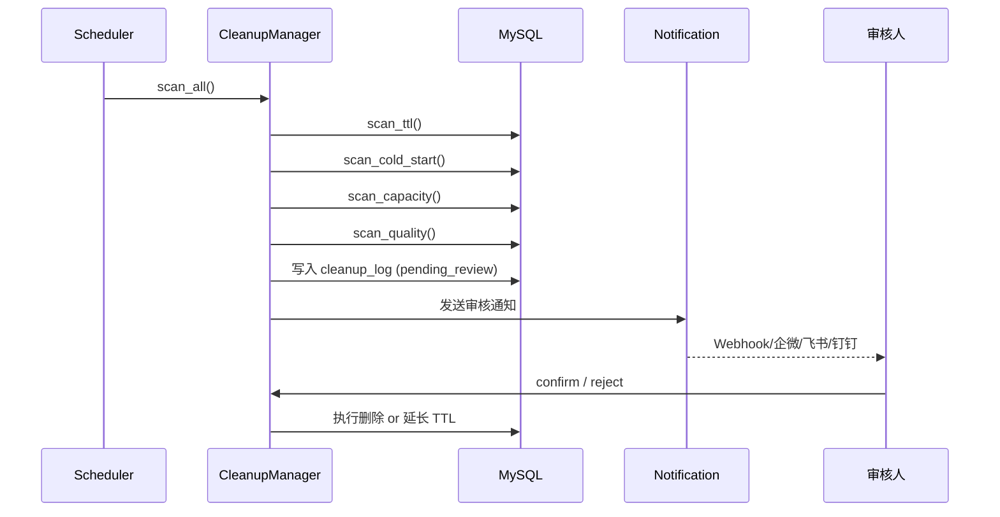

# 过期清理策略

Cleanup Manager 模块负责按策略清理过期、低质量内容，采用**审核制**防止误删。

## 清理流程



## 四种清理策略

### 1. TTL 时间过期

按 `source_type` 配置过期天数：

```yaml
# configs/cleanup_policies.yaml
policies:
  - source_type: rss
    ttl_days: 30        # RSS 内容 30 天过期
  - source_type: hot_keyword
    ttl_days: 7         # 热搜内容 7 天过期
```

```sql
-- 扫描逻辑
SELECT id FROM cs_items
WHERE source_type = 'rss'
  AND created_at < NOW() - INTERVAL 30 DAY
  AND status = 'published';
```

### 2. 冷启动失败清理

入库后长时间无曝光无点击的内容加速淘汰：

```yaml
policies:
  - source_type: hot_keyword
    cold_start_ttl_days: 3  # 3 天无曝光即淘汰
```

```sql
SELECT id FROM cs_items
WHERE source_type = 'hot_keyword'
  AND exposure_count = 0
  AND click_count = 0
  AND created_at < NOW() - INTERVAL 3 DAY;
```

### 3. 容量上限淘汰

当某 source_type 内容数超过上限时，按质量+时间淘汰：

```yaml
policies:
  - source_type: rss
    max_items: 10000    # RSS 最多 10000 条
```

```sql
-- 超出部分按质量升序 + 时间升序淘汰
SELECT id FROM cs_items
WHERE source_type = 'rss'
ORDER BY quality_score ASC, created_at ASC
LIMIT (count - max_items);
```

### 4. 质量评分淘汰

清理低于质量阈值的内容（保护新内容）：

```yaml
policies:
  - source_type: rss
    min_quality: 0.2    # 质量分低于 0.2 淘汰
```

```sql
SELECT id FROM cs_items
WHERE source_type = 'rss'
  AND quality_score < 0.2
  AND created_at < NOW() - INTERVAL 1 DAY;  -- 保护 24h 内新内容
```

## 审核制

!!! warning "安全第一"
    清理操作采用**两阶段提交**：扫描生成待删清单 → 人工审核确认 → 执行删除。

### 阶段 1：扫描

```bash
# 手动触发扫描（不会删除任何内容）
curl -X POST http://localhost:8010/cleanup/trigger
```

生成 `cs_cleanup_logs` 记录，状态为 `pending_review`。

### 阶段 2：通知

自动通过配置的通知渠道发送审核通知：

- Webhook
- 企业微信
- 飞书
- 钉钉

### 阶段 3：确认/拒绝

```bash
# 确认删除
curl -X POST http://localhost:8010/cleanup/{log_id}/confirm

# 拒绝删除（延长 TTL）
curl -X POST http://localhost:8010/cleanup/{log_id}/reject
```

### 自动确认

超过配置时间未操作的清理任务将自动确认执行：

```yaml
# configs/app.yaml
cleanup:
  auto_confirm_after_hours: 24  # 24 小时后自动确认
```

## API 速查

| 端点 | 方法 | 说明 |
|------|------|------|
| `/cleanup/policies` | GET | 查看清理策略 |
| `/cleanup/trigger` | POST | 触发扫描 |
| `/cleanup/pending` | GET | 查看待审核清单 |
| `/cleanup/{id}/confirm` | POST | 确认删除 |
| `/cleanup/{id}/reject` | POST | 拒绝删除 |
| `/cleanup/logs` | GET | 清理日志 |
