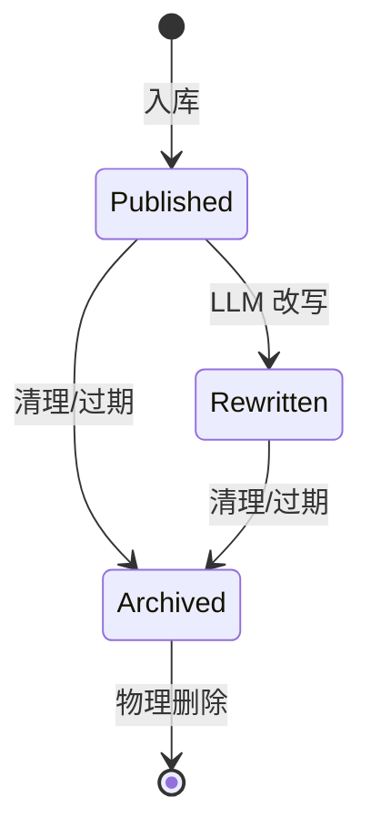

# 内容池管理

Content Supply Platform 采用**单池多标签**设计管理所有内容。

## 设计理念

!!! info "单池 vs 多池"
    我们选择单池（single pool）设计：所有内容存入同一张 `cs_items` 表，通过字段组合筛选。

    优势：查询灵活、无跨池同步问题、管理简单。

## 内容池结构

```
cs_items（单池）
├── source_type: rss / web / hot_keyword / manual
├── category: tech / entertainment / news / ...
├── content_type: article / video / post
├── tags: ["AI", "机器学习", ...]
├── status: draft / published / archived
└── is_rewritten: true / false
```

## 查询模式

推荐系统通过组合条件筛选内容：

```sql
-- 获取所有可推荐内容
SELECT * FROM cs_items
WHERE status = 'published'
ORDER BY quality_score DESC;

-- 按 source_type 筛选
SELECT * FROM cs_items
WHERE source_type = 'rss' AND status = 'published';

-- 按分类 + 标签筛选
SELECT * FROM cs_items
WHERE category = 'tech' AND status = 'published'
ORDER BY quality_score DESC;

-- 获取热门内容
SELECT * FROM cs_items
WHERE source_type = 'hot_keyword'
ORDER BY quality_score DESC;
```

## Redis 同步

内容入库时同步更新 Redis：

| Redis Key | 类型 | 说明 |
|-----------|------|------|
| `item_pool:all` | SET | 所有可推荐 item_id |
| `hot_items:global` | ZSET | 热门内容，score = quality_score |

```python
# 入库同步
await redis.sadd("item_pool:all", item_id)
await redis.zadd("hot_items:global", {item_id: quality_score})

# 推荐系统召回
item_ids = await redis.smembers("item_pool:all")
hot_ids = await redis.zrevrange("hot_items:global", 0, 49)
```

## 内容生命周期



## Item 字段说明

| 字段 | 类型 | 说明 |
|------|------|------|
| id | VARCHAR(64) | URL hash 或 UUID |
| title | VARCHAR(500) | 标题 |
| summary | TEXT | 摘要 |
| content | TEXT | 正文（改写后 or 原文） |
| original_content | TEXT | 原始正文（改写前备份） |
| url | VARCHAR(1024) | 原文链接（UNIQUE） |
| source_type | ENUM | 数据源类型 |
| category | VARCHAR(100) | 分类 |
| tags | TEXT | 标签列表 |
| quality_score | FLOAT | 质量评分 0-1 |
| content_hash | VARCHAR(64) | SHA256 去重 |
| is_rewritten | BOOL | 是否已改写 |
| exposure_count | INT | 曝光次数 |
| click_count | INT | 点击次数 |
| status | ENUM | 内容状态 |
