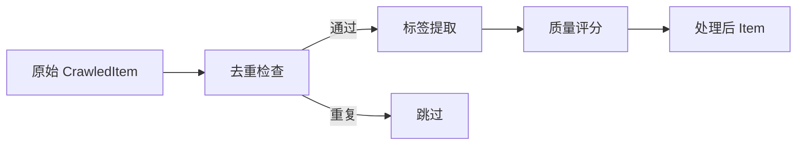

# 内容处理管线

Content Processor 模块负责内容去重、标签提取和质量评分。

## 处理流程



## 去重机制

### URL 精确匹配

检查 `cs_items` 表中是否已存在相同 URL：

```sql
SELECT id FROM cs_items WHERE url = ?
```

### 内容哈希去重

即使 URL 不同，内容相同也会被拦截：

```python
content_hash = hashlib.sha256(content.encode()).hexdigest()
```

```sql
SELECT id FROM cs_items WHERE content_hash = ?
```

!!! tip "双层去重"
    URL 去重处理「同一文章多次出现」的场景，内容哈希去重处理「不同 URL 相同内容」的场景。

## 标签提取

### 英文关键词

基于词频统计，过滤停用词：

1. 分词（空格分割）
2. 转小写，去除标点
3. 过滤停用词（the, is, a, ...）
4. 按词频排序，取 Top-N

### 中文关键词

基于字符 bigram：

1. 提取中文字符序列
2. 生成 2-4 字长度的 bigram
3. 按频率排序

### 合并标签

最终标签 = 原始标签（来自 RSS tags） + 提取标签，去重后存储。

## 质量评分

多维度加权评分，满分 **1.0**：

| 维度 | 权重范围 | 计算方式 |
|------|----------|----------|
| 内容长度 | 0 - 0.30 | `min(len(content) / 2000, 1.0) * 0.30` |
| 图片质量 | 0 - 0.20 | 有图 0.20，无图 0 |
| 来源信誉 | 0 - 0.20 | rss=0.20, hot_keyword=0.15, web=0.10, manual=0.20 |
| 标签丰富度 | 0 - 0.30 | `min(tag_count / 5, 1.0) * 0.30` |

### 评分示例

| 内容 | 长度 | 图片 | 来源 | 标签 | 总分 |
|------|------|------|------|------|------|
| 2000字 RSS 文章 | 0.30 | 0.20 | 0.20 | 0.30 | **1.00** |
| 500字 RSS 文章 | 0.075 | 0 | 0.20 | 0.12 | **0.395** |
| 1000字网页抓取 | 0.15 | 0.20 | 0.10 | 0.18 | **0.63** |

## 配置

质量评分参数硬编码在 `content_processor.py` 中，可通过代码调整各维度权重。
