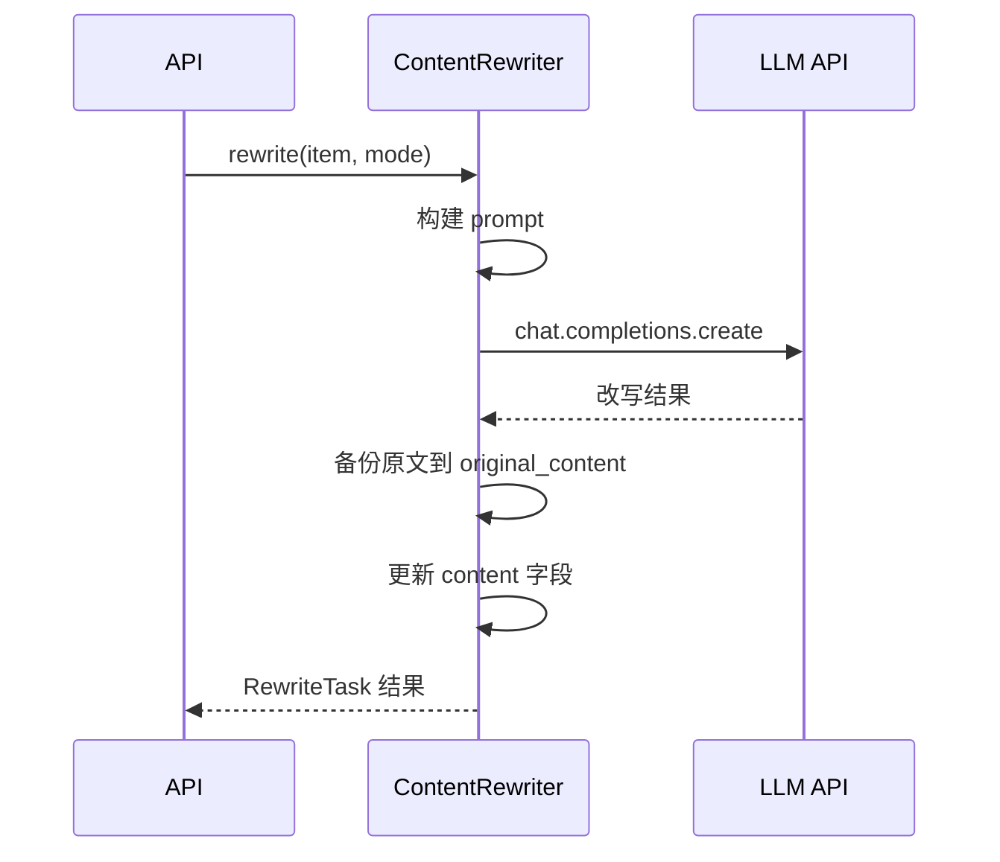

# 内容改写引擎

Content Rewriter 模块使用 LLM 对原始内容进行改写，支持多种改写模式。

## 工作原理



## 改写模式

### paraphrase — 伪原创

保持内容主旨不变，用不同措辞重新表述。

```bash
curl -X POST http://localhost:8010/rewrite/{item_id} \
  -H "Content-Type: application/json" \
  -d '{"rewrite_type": "paraphrase"}'
```

适用场景：规避版权风险，生成「原创」内容。

### summarize — 摘要生成

将长文压缩为精简摘要，保留核心信息。

```bash
curl -X POST http://localhost:8010/rewrite/{item_id} \
  -H "Content-Type: application/json" \
  -d '{"rewrite_type": "summarize"}'
```

适用场景：信息提炼，长文精简。

### expand — 内容扩展

对短文进行扩展，增加细节和背景信息。

```bash
curl -X POST http://localhost:8010/rewrite/{item_id} \
  -H "Content-Type: application/json" \
  -d '{"rewrite_type": "expand"}'
```

适用场景：内容充实，短文扩充。

## 批量改写

```bash
curl -X POST http://localhost:8010/rewrite/batch \
  -H "Content-Type: application/json" \
  -d '{
    "source_type": "rss",
    "rewrite_type": "paraphrase",
    "limit": 10
  }'
```

## LLM 配置

支持任何 OpenAI-compatible API：

```yaml
# configs/app.yaml
llm:
  base_url: "http://localhost:11434/v1"
  api_key: "ollama"
  model: "qwen2.5:7b"
  max_tokens: 2048
  temperature: 0.7
```

| 提供商 | base_url | 说明 |
|--------|----------|------|
| Ollama | `http://localhost:11434/v1` | 本地推理 |
| vLLM | `http://localhost:8000/v1` | GPU 加速 |
| OpenAI | `https://api.openai.com/v1` | 云端 API |

## 数据保护

- 原文始终保留在 `original_content` 字段
- `is_rewritten` 标记改写状态
- `rewrite_task_id` 关联改写任务记录

## 改写任务追踪

每次改写操作都会在 `cs_rewrite_tasks` 表创建一条记录：

| 字段 | 说明 |
|------|------|
| item_id | 关联的内容 ID |
| rewrite_type | 改写类型 |
| status | pending / running / done / failed |
| original_hash | 原文哈希 |
| llm_model | 使用的 LLM 模型 |
| prompt_used | 使用的 prompt |
| error_message | 错误信息 |
