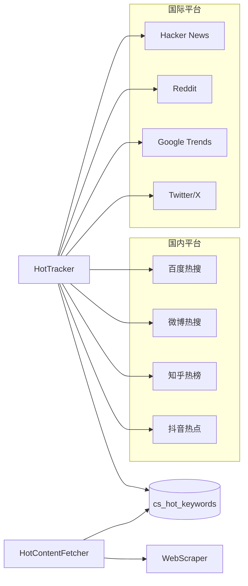

# 热搜词采集

HotTracker 模块负责从多个平台实时采集热搜词/热门话题。

## 工作原理



## 支持平台

| 平台 | 适配器 | 说明 |
|------|--------|------|
| Hacker News | `HackerNewsAdapter` | HN 首页热门 |
| Reddit | `RedditAdapter` | Reddit 前页热门 |
| Google Trends | `GoogleTrendsAdapter` | 搜索趋势 |
| 百度热搜 | `BaiduAdapter` | 百度搜索热词 |
| 微博热搜 | `WeiboAdapter` | 微博话题热词 |
| 知乎热榜 | `ZhihuAdapter` | 知乎热门问题 |
| 抖音热点 | `DouyinAdapter` | 抖音热门话题 |

## 使用方式

### 触发热搜词采集

```bash
curl -X POST http://localhost:8010/hot/trigger
```

### 查看热搜词

```bash
# 查看所有平台热搜词
curl "http://localhost:8010/hot/keywords?limit=20"

# 按平台筛选
curl "http://localhost:8010/hot/keywords?platform=hackernews&limit=10"
```

### 自动采集

在 `configs/app.yaml` 中配置调度间隔：

```yaml
scheduler:
  hot_track_interval: 3600  # 每小时采集一次
```

## 热搜词数据结构

每个热搜词包含：

| 字段 | 说明 |
|------|------|
| keyword | 热搜词文本 |
| platform | 来源平台 |
| rank | 排名 |
| hot_score | 热度值 |
| category | 分类 |
| status | pending / fetched / processing / done |
| content_fetched | 是否已抓取相关内容 |

## 热点内容抓取

采集到热搜词后，HotContentFetcher 会：

1. 按关键词在 DuckDuckGo 搜索相关文章 URL
2. 并发调用 WebScraper 抓取正文
3. 走标准处理管线入库

```bash
# 触发按热搜词抓取内容
curl -X POST http://localhost:8010/hot/trigger
```

## 配置

在 `configs/hot_sources.yaml` 中配置平台：

```yaml
sources:
  - name: hackernews
    adapter: hackernews
    url: "https://news.ycombinator.com/"
    interval: 3600
    enabled: true

  - name: reddit
    adapter: reddit
    url: "https://www.reddit.com/"
    interval: 1800
    enabled: true
```
