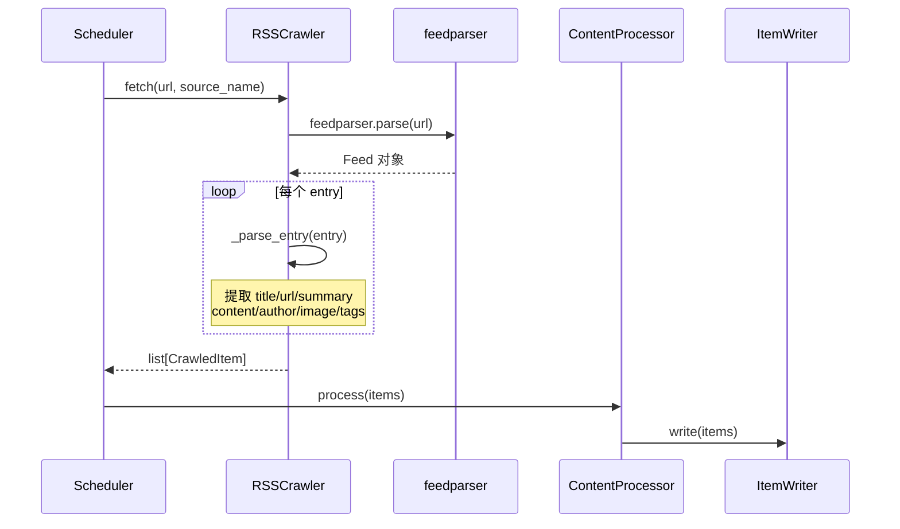

# RSS 订阅抓取

RSS Crawler 模块负责定期抓取和解析 RSS/Atom feed，将条目标准化后交给下游处理管线。

## 工作原理



## 使用方式

### 通过 API 添加 RSS 源

```bash
curl -X POST http://localhost:8010/feeds \
  -H "Content-Type: application/json" \
  -d '{
    "name": "TechCrunch",
    "url": "https://techcrunch.com/feed/",
    "source_type": "rss",
    "category": "tech",
    "poll_interval": 1800
  }'
```

### 手动触发抓取

```bash
curl -X POST http://localhost:8010/crawl/feed/1
```

### 定时自动抓取

在 `configs/app.yaml` 中配置调度器后，系统会自动按 `poll_interval` 轮询所有 active 状态的 Feed。

## 字段提取

| 字段 | 来源 | 说明 |
|------|------|------|
| title | `entry.title` | 标题（必填） |
| url | `entry.link` | 原文链接（必填） |
| summary | `entry.summary` / `entry.description` | 摘要 |
| content | `entry.content[0].value` | 全文正文 |
| author | `entry.author` | 作者 |
| image_url | `media_content` / `enclosures` | 封面图 |
| published_at | `entry.published_parsed` | 发布时间 |
| tags | `entry.tags[].term` | 分类标签 |

## 错误处理

- **Feed 解析失败**：`bozo` 位检测，仅在无条目且无标题时报错
- **单条目失败**：跳过该条目，不影响批次中其他条目
- **网络超时**：由上层 httpx 处理

## 配置参数

在 `configs/feeds.yaml` 中配置初始 RSS 源：

```yaml
feeds:
  - name: "Hacker News"
    url: "https://hnrss.org/frontpage"
    source_type: "rss"
    category: "tech"
    poll_interval: 1800

  - name: "36Kr"
    url: "https://36kr.com/feed"
    source_type: "rss"
    category: "tech"
    poll_interval: 3600
```
