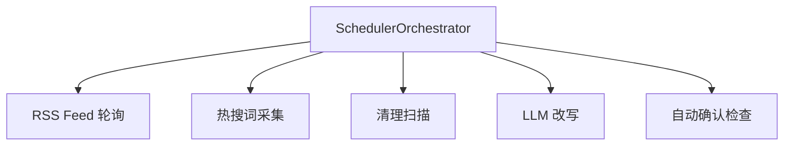

# 任务调度器

Scheduler 模块使用 APScheduler 编排所有定时任务。

## 调度任务



| 任务 | 调度方式 | 默认间隔 | 说明 |
|------|----------|----------|------|
| RSS 轮询 | IntervalTrigger | 按 feed.poll_interval | 每个 Feed 独立调度 |
| 热搜采集 | IntervalTrigger | 3600s | 采集所有启用平台 |
| 清理扫描 | CronTrigger | 每天 03:00 | 扫描过期内容 |
| LLM 改写 | CronTrigger | 每天 04:00 | 改写未处理内容 |
| 自动确认 | IntervalTrigger | 3600s | 检查超时的清理任务 |

## 启动流程

```python
# SchedulerOrchestrator.start()
1. 创建 APScheduler AsyncIOScheduler
2. 加载所有 active Feed → 为每个创建 IntervalTrigger job
3. 注册热搜采集 interval job
4. 注册清理扫描 cron job
5. 注册 LLM 改写 cron job
6. 注册自动确认检查 interval job
7. 启动 scheduler
```

## RSS Feed 调度

每个 Feed 有独立的轮询间隔：

```yaml
# configs/feeds.yaml
feeds:
  - name: "Hacker News"
    poll_interval: 1800  # 30 分钟
  - name: "TechCrunch"
    poll_interval: 3600  # 1 小时
```

## 配置

在 `configs/app.yaml` 中调整：

```yaml
scheduler:
  enabled: true
  hot_track_interval: 3600       # 热搜采集间隔（秒）
  cleanup_cron: "0 3 * * *"      # 清理扫描 cron
  rewrite_cron: "0 4 * * *"      # LLM 改写 cron
  auto_confirm_interval: 3600    # 自动确认检查间隔（秒）
```

## 手动触发

所有调度任务都可通过 API 手动触发，无需等待定时调度：

```bash
# 手动触发 RSS 抓取
curl -X POST http://localhost:8010/crawl/feed/{id}

# 手动触发热搜采集
curl -X POST http://localhost:8010/hot/trigger

# 手动触发清理扫描
curl -X POST http://localhost:8010/cleanup/trigger

# 手动触发改写
curl -X POST http://localhost:8010/rewrite/{item_id}
```
