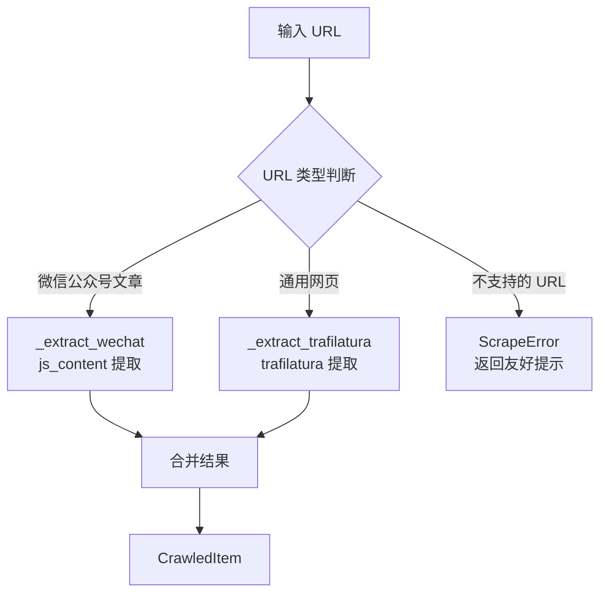

# 网页内容抓取

Web Scraper 模块负责从任意 URL 提取高质量正文和图片，支持通用网页和微信公众号文章。

## 工作原理



## 站点适配器

### 通用网页（trafilatura）

使用 [trafilatura](https://trafilatura.readthedocs.io/) 库：

- 自动识别正文区域，去除导航、广告、侧边栏
- 保留段落结构和换行
- 支持多种网页模板

### 微信公众号文章

专门适配 `mp.weixin.qq.com/s/` 格式的文章链接：

| 提取字段 | 来源 |
|----------|------|
| 标题 | `var msg_title` 或 `<h1 class="rich_media_title">` |
| 正文 | `<div id="js_content">` 内的文本 |
| 作者 | `var nickname` |
| 发布时间 | `var ct`（Unix 时间戳）或 `var publish_time` |
| 封面图 | `og:image` meta 标签 |

!!! success "支持格式"
    ```
    https://mp.weixin.qq.com/s/xxxxxxxxxxxx          # 短链 ✅
    https://mp.weixin.qq.com/s?__biz=xxx&mid=xxx...  # 长链 ✅
    ```

!!! danger "不支持的格式"
    ```
    https://mp.weixin.qq.com/cgi-bin/...  # 后台页面 ❌（需登录+JS渲染）
    ```

    对这类 URL 会返回友好提示，引导使用正确的文章链接格式。

## 使用方式

### 手动抓取单个 URL

```bash
# 通用网页
curl -X POST http://localhost:8010/crawl/url \
  -H "Content-Type: application/json" \
  -d '{"url": "https://example.com/article"}'

# 微信公众号文章
curl -X POST http://localhost:8010/crawl/url \
  -H "Content-Type: application/json" \
  -d '{"url": "https://mp.weixin.qq.com/s/xxxxxxxxxxxx"}'
```

### 响应格式

成功时返回任务状态 + 抓取到的内容：

```json
{
  "task": {
    "id": 12,
    "url": "https://mp.weixin.qq.com/s/xxx",
    "task_type": "manual",
    "status": "done",
    "items_found": 1,
    "items_new": 1,
    "error_message": null
  },
  "item": {
    "title": "文章标题",
    "url": "https://mp.weixin.qq.com/s/xxx",
    "content": "正文内容...",
    "author": "作者",
    "published_at": "2026-04-04T21:03:03",
    "source_type": "manual",
    "tags": []
  }
}
```

不支持的 URL 返回友好提示：

```json
{
  "task": {
    "status": "failed",
    "error_message": "不支持抓取: 微信公众号后台页面，请使用文章链接格式：mp.weixin.qq.com/s/xxx"
  },
  "item": null
}
```

### 在热点内容抓取中自动调用

HotContentFetcher 搜索到 URL 后，会自动调用 WebScraper 抓取正文。

## 图片提取

优先级：

1. `<meta property="og:image">` — Open Graph 协议
2. `<meta name="twitter:image">` — Twitter Card
3. 正文中第一张有意义的图片

## robots.txt 合规

- **自动抓取**（Feed 轮询、热点内容）：遵循 robots.txt
- **手动抓取**（`/crawl/url`）：跳过 robots.txt 检查，因为用户主动请求

## 并发控制

通过信号量（Semaphore）限制同时进行的 HTTP 请求数量，避免对目标站点造成过大压力。

## 已知限制

| 场景 | 说明 | 解决方案 |
|------|------|----------|
| JS 渲染页面 | SPA/动态加载的页面无法抓取 | 计划支持 Playwright |
| 登录墙内容 | 需要登录才能查看的页面 | 无法抓取 |
| 微信后台页面 | `/cgi-bin/` 路径下的页面 | 使用 `mp.weixin.qq.com/s/` 文章链接 |
| 非HTML文件 | PDF/视频/音频等 | 暂不支持 |

## 配置

在 `configs/app.yaml` 中调整：

```yaml
web_scraper:
  timeout: 30          # 单页超时（秒）
  max_concurrent: 5    # 最大并发数
  respect_robots_txt: true
```
