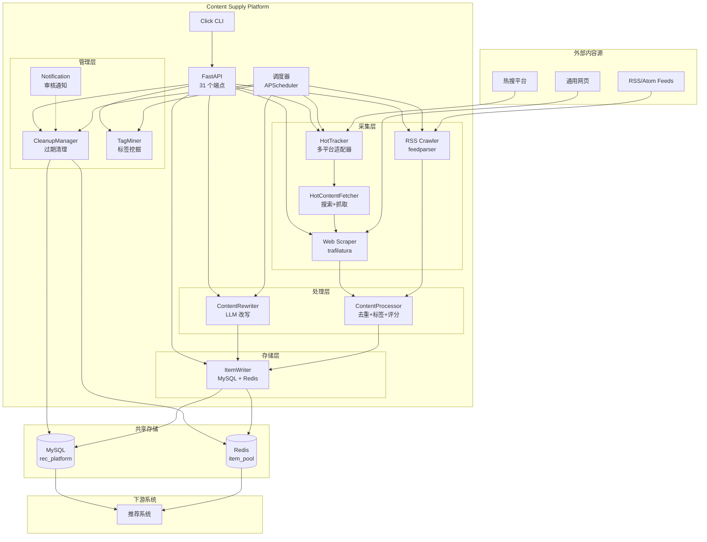

# 产品架构

## 系统架构



## 数据流

### RSS 采集流

```
Scheduler → RSS Crawler → Content Processor → Item Writer → MySQL + Redis
```

1. 调度器按 `poll_interval` 触发 RSS 抓取
2. `feedparser` 解析 RSS/Atom，输出标准化 `CrawledItem`
3. `ContentProcessor` 执行去重（URL + SHA256）、标签提取、质量评分
4. `ItemWriter` 写入 MySQL `cs_items` 并 SADD/ZADD 到 Redis

### 热搜内容流

```
Scheduler → HotTracker(多平台) → HotKeyword 入库
         → HotContentFetcher(搜索) → Web Scraper → Processor → Writer
```

1. 调度器触发热搜词采集
2. 各平台适配器（HN/Reddit/Google）采集热搜词
3. 按关键词搜索相关文章 URL
4. 走 Web Scraper → Processor → Writer 入库

### LLM 改写流

```
API/Scheduler → ContentRewriter → Update Item → Redis
```

1. 选择待改写内容
2. 调用 LLM（paraphrase/summarize/expand）
3. 原文保存到 `original_content`，改写结果写入 `content`

### 清理流

```
Scheduler → CleanupManager(扫描) → 生成待删清单 → 通知审核 → 确认删除
```

## 技术选型

| 层级 | 技术 | 选型理由 |
|------|------|----------|
| Web 框架 | FastAPI | 异步、高性能、自动文档 |
| ORM | SQLAlchemy 2.0 async | 异步数据库操作，类型安全 |
| HTTP 客户端 | httpx | 异步 HTTP，超时控制 |
| RSS 解析 | feedparser | RSS/Atom 标准解析库 |
| 网页提取 | trafilatura | 高质量正文提取 |
| LLM 调用 | OpenAI-compatible API | 支持 Ollama/vLLM/OpenAI |
| 调度 | APScheduler | 轻量级定时任务，无额外依赖 |
| 缓存 | Redis | 高性能，支持 SET/ZSET |
| CLI | Click | Python 标准命令行框架 |

## 目录结构

```
content-supply/
├── content_supply/
│   ├── api/              # FastAPI 路由（31 个端点）
│   ├── models/           # ORM 模型（6 张表）
│   ├── schemas/          # Pydantic 请求/响应
│   ├── services/         # 业务逻辑（12 个服务）
│   │   ├── types.py      # 共享数据类型
│   │   ├── rss_crawler.py
│   │   ├── web_scraper.py
│   │   ├── hot_tracker.py
│   │   ├── hot_content_fetcher.py
│   │   ├── content_processor.py
│   │   ├── content_rewriter.py
│   │   ├── item_writer.py
│   │   ├── cleanup_manager.py
│   │   ├── notification.py
│   │   ├── tag_miner.py
│   │   └── scheduler.py
│   ├── config.py         # 配置系统
│   ├── db.py             # 数据库管理
│   ├── main.py           # 应用入口
│   └── cli.py            # CLI 入口
├── configs/              # YAML 配置
├── tests/                # 测试
├── scripts/              # SQL DDL
└── docs/                 # 文档
```
